# 1. Wstęp

Niniejszy raport stanowi dokumentację techniczną projektu realizowanego w ramach
przedmiotu *Bezpieczeństwo Systemów Komputerowych* (SCS). Celem projektu było
zaprojektowanie i implementacja zestawu aplikacji emulujących środowisko wymiany
danych pomiędzy Użytkownikiem (User) a Serwerem (Server) z udziałem Zaufanej
Trzeciej Strony (Trusted Third Party, TTP). TTP pełni rolę urzędu certyfikacji
(CA), wystawiając certyfikaty X.509 oraz dystrybuując klucze sesyjne AES-256
pomiędzy stronami komunikacji.

Projekt został zrealizowany w języku Go (wersja 1.26.1) z wykorzystaniem
wyłącznie bibliotek standardowych. Środowisko uruchomieniowe oparte jest na
kontenerach Docker, zapewniających separację komponentów TTP oraz Serwera.
Aplikacja kliencka udostępnia interfejs webowy.

Kod źródłowy projektu dostępny jest w repozytorium GitLab Uniwersytetu
Gdańskiego: `git.pg.edu.pl:pggit_oidc4152412/scs_tu1314_kwiatek.git`

---

# 2. Opis zrealizowanego zadania

Zrealizowano kompletny system składający się z trzech niezależnych aplikacji:

1. **TTP** (Trusted Third Party) — urząd certyfikacji, serwer uwierzytelniania
   i dystrybucji kluczy sesyjnych. Nasłuchuje na porcie `8181`.

2. **Server** — serwer plików świadczący usługę szyfrowanego transferu danych.
   Udostępnia pliki z katalogu `shared_files/`. Nasłuchuje na porcie `8282`.

3. **User** — aplikacja kliencka z interfejsem webowym (port `9000`),
   umożliwiająca rejestrację w TTP, przeglądanie listy plików oraz ich
   bezpieczne pobieranie z szyfrowaniem end-to-end.

Dodatkowo zaimplementowano **MITM proxy** (`cmd/mitm`) służące do demonstracji
odporności systemu na ataki typu *man-in-the-middle* z podszywaniem się pod
tożsamość serwera.

---

# 3. Architektura systemu

## 3.1. Schemat komunikacji

Przepływ komunikacji w systemie przebiega następująco:

```
User                    Server                   TTP
 |                        |                       |
 |---(1) request-file---->|                       |
 |                        |---(2) auth-server---->|
 |<--(3) sessionID, srvID-|                       |
 |                                                |
 |---------------(4) auth-user------------------->|
 |<--------------(5) {aes_key, srvID}--------------|
 |                                                |
 |---(6) download-file--->|                       |
 |                        |---(7) fetch-key------>|
 |                        |<--(8) encrypted_aes---|
 |<--(9) encrypted_data---|                       |
```

1. User wysyła żądanie pliku do Servera.
2. Server inicjalizuje sesję w TTP, podając swój identyfikator.
3. Server zwraca Userowi `session_id` oraz własny `server_id`.
4. User uwierzytelnia się w TTP (zaszyfrowany ID, klucz publiczny RSA).
5. TTP generuje klucz AES-256, szyfruje go osobno dla Usera i Servera,
   zwraca Userowi payload zawierający klucz AES oraz potwierdzony `server_id`.
6. User weryfikuje tożsamość Servera (porównanie `server_id` z TTP
   z `server_id` otrzymanym bezpośrednio od Servera). Jeśli zgodne —
   kontynuuje.
7. Server pobiera z TTP zaszyfrowany klucz AES.
8. Server deszyfruje klucz AES własnym kluczem prywatnym RSA.
9. Server szyfruje plik algorytmem AES-256-GCM i przesyła do Usera.
10. User deszyfruje plik i zapisuje lokalnie.

## 3.2. Środowisko sieciowe

System wykorzystuje kontenery Docker do separacji komponentów:

| Komponent | Obraz bazowy | Port | Wolumeny |
|-----------|-------------|------|----------|
| TTP       | `alpine:latest` | 8181 | `./logs/ttp` (logi) |
| Server    | `alpine:latest` | 8282 | `./shared_files`, `./logs/server` |
| User      | uruchamiany natywnie | 9000 | `./downloads` |

Kontenery komunikują się poprzez dedykowaną sieć Docker `secure-exchange-net`.
Konfiguracja zawarta jest w plikach `docker-compose.ttp.yml` oraz
`docker-compose.server.yml`. Skrypt `run.sh` orkiestruje uruchomienie
wszystkich komponentów.

---

# 4. Opis kluczowych funkcjonalności

## 4.1. Generacja kluczy kryptograficznych

Każda encja (User, Server) generuje parę kluczy RSA o długości 4096 bitów
przy użyciu kryptograficznie bezpiecznego generatora pseudolosowego
(`crypto/rand`). Dodatkowo TTP generuje własną parę kluczy RSA dla urzędu
certyfikacji (Root CA).

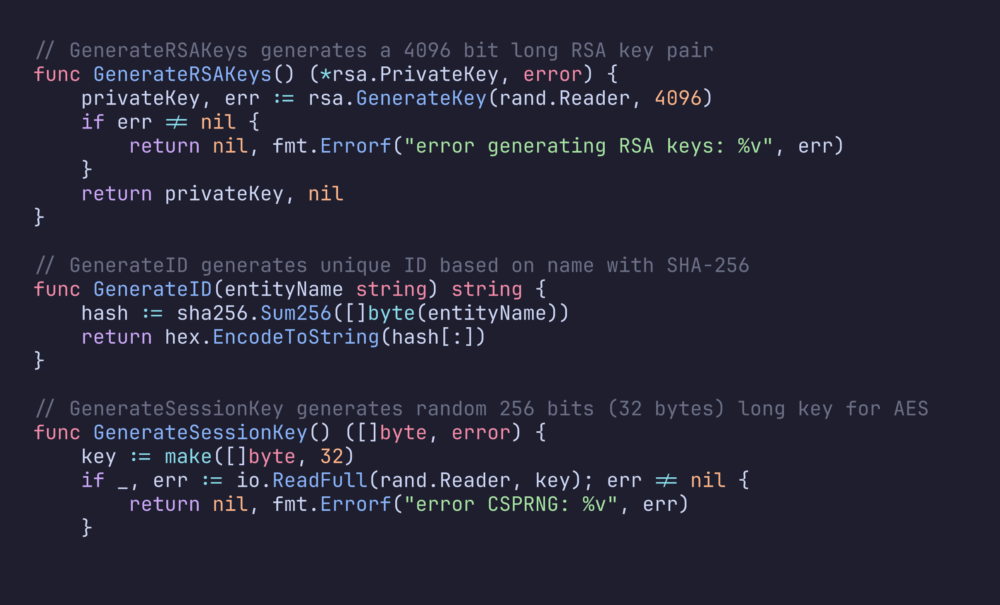

*Listing 1: Funkcje `GenerateRSAKeys()` (linie 16–22), `GenerateID()` (linie 24–28)
oraz `GenerateSessionKey()` (linie 30–37) w pliku `crypto/crypto.go`.*

Klucz sesyjny AES-256 (32 bajty) generowany jest przy użyciu CSPRNG
(`io.ReadFull(rand.Reader, key)`), co gwarantuje nieprzewidywalność
kolejnych kluczy.

## 4.2. Szyfrowanie asymetryczne (RSA-OAEP)

Dane wymagające poufności (identyfikatory encji, klucze sesyjne AES)
szyfrowane są algorytmem RSA-OAEP z funkcją skrótu SHA-256.

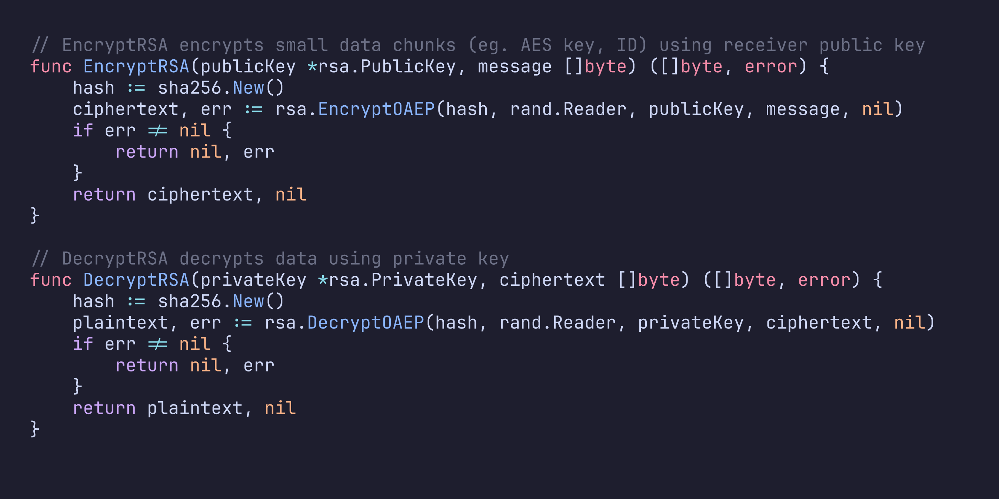

*Listing 2: Funkcje `EncryptRSA()` (linie 87–94) oraz `DecryptRSA()` (linie 96–104)
w pliku `crypto/crypto.go`.*

## 4.3. Szyfrowanie symetryczne (AES-256-GCM)

Transfer plików odbywa się z wykorzystaniem szyfrowania AES-256 w trybie GCM
(Galois/Counter Mode), który zapewnia zarówno poufność, jak i integralność
danych (AEAD — Authenticated Encryption with Associated Data).

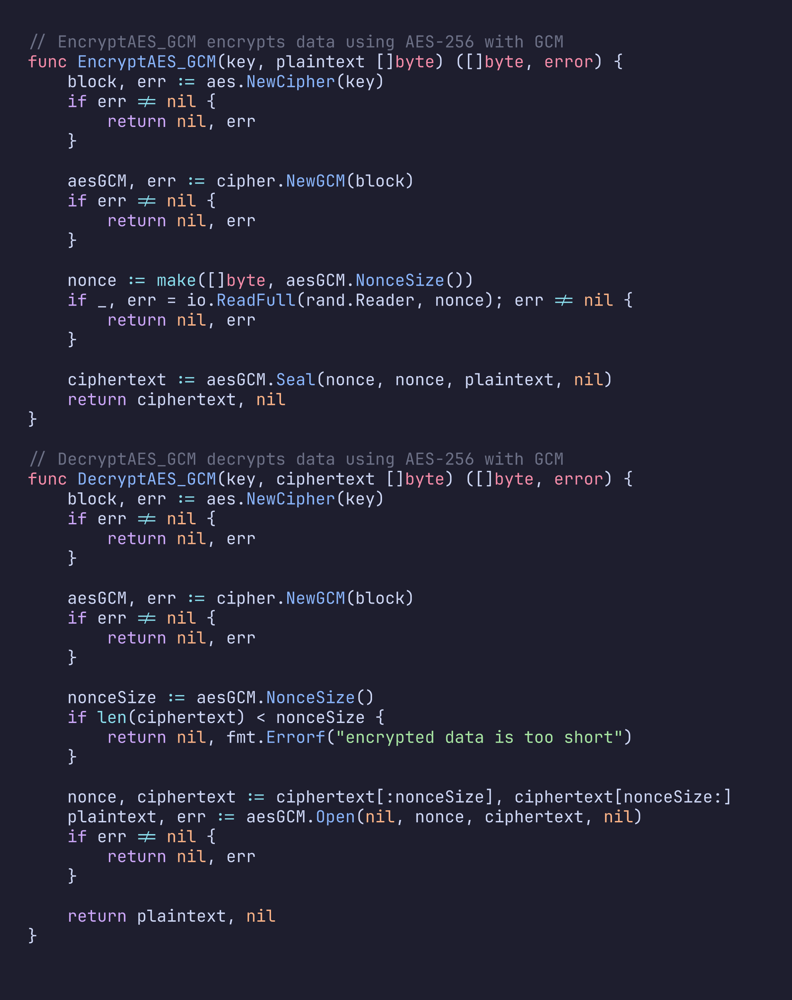

*Listing 3: Funkcje `EncryptAES_GCM()` (linie 40–58) oraz `DecryptAES_GCM()`
(linie 60–84) w pliku `crypto/crypto.go`.*

Wektor inicjalizujący (nonce) o długości 12 bajtów generowany jest losowo
dla każdej operacji szyfrowania i prependowany do szyfrogramu.

## 4.4. Infrastruktura X.509 — urząd certyfikacji

TTP pełni rolę urzędu certyfikacji (Root CA). Podczas uruchomienia generuje
samopodpisany certyfikat CA, który następnie służy do podpisywania
certyfikatów encji.

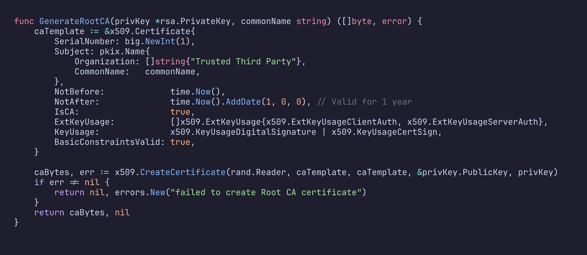

*Listing 4: Funkcja `GenerateRootCA()` (linie 14–34) w pliku `crypto/x509.go`.*

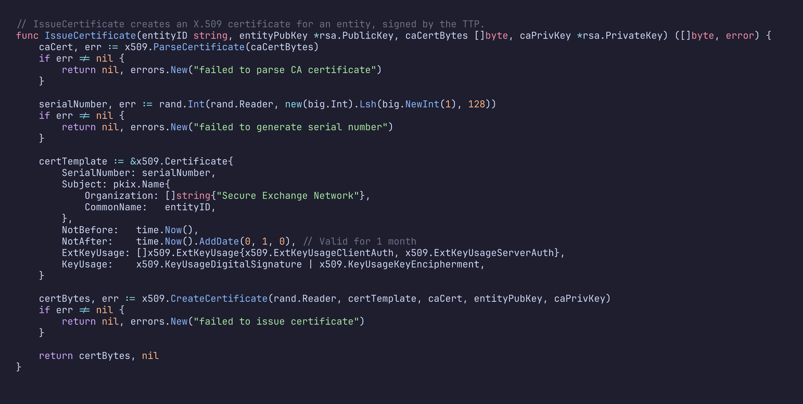

*Listing 5: Funkcja `IssueCertificate()` (linie 37–66) w pliku `crypto/x509.go`.*

Certyfikaty encji wydawane są z miesięcznym okresem ważności i zawierają
rozszerzenia `ExtKeyUsageClientAuth` oraz `ExtKeyUsageServerAuth`.

## 4.5. Rejestracja encji w TTP

Proces rejestracji przebiega następująco:
1. Encja pobiera certyfikat Root CA z TTP (endpoint `GET /ca`).
2. Generuje swój identyfikator (SHA-256 z nazwy) i szyfruje go kluczem
   publicznym TTP (RSA-OAEP).
3. Wysyła zaszyfrowany ID oraz własny klucz publiczny (PEM) do TTP
   (endpoint `POST /register`).
4. TTP deszyfruje identyfikator, weryfikuje poprawność danych i wydaje
   certyfikat X.509 podpisany kluczem CA.

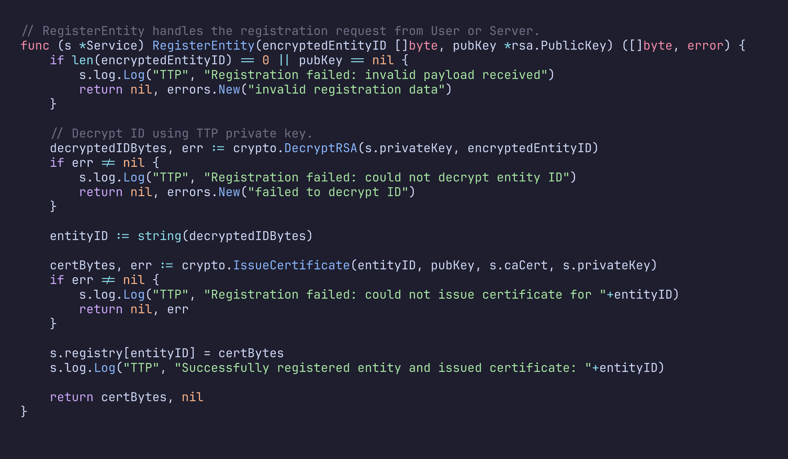

*Listing 6: Funkcja `RegisterEntity()` (linie 58–84) w pliku `ttp/service.go`.*

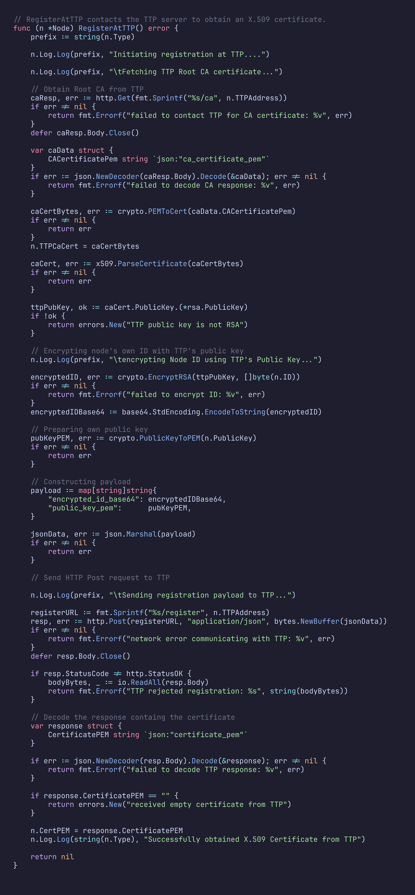

*Listing 7: Funkcja `RegisterAtTTP()` (linie 62–159) w pliku `node/node.go`.*

## 4.6. Uwierzytelnianie i dystrybucja klucza sesyjnego

Po zainicjowaniu sesji przez Server, User uwierzytelnia się w TTP. TTP
weryfikuje tożsamość Usera na podstawie zarejestrowanego certyfikatu,
generuje klucz sesyjny AES-256 i dystrybuuje go:

- Dla Usera: klucz AES + potwierdzony `server_id`, zaszyfrowane kluczem
  publicznym RSA Usera
- Dla Servera: klucz AES zaszyfrowany kluczem publicznym RSA Servera
  (przechowywany w sesji do momentu pobrania)

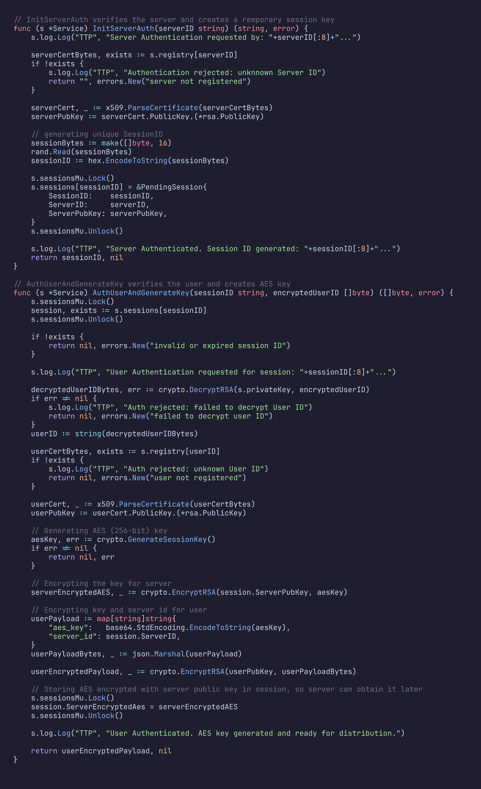

*Listing 8: Funkcje `InitServerAuth()` (linie 92–119) oraz
`AuthUserAndGenerateKey()` (linie 121–175) w pliku `ttp/service.go`.*

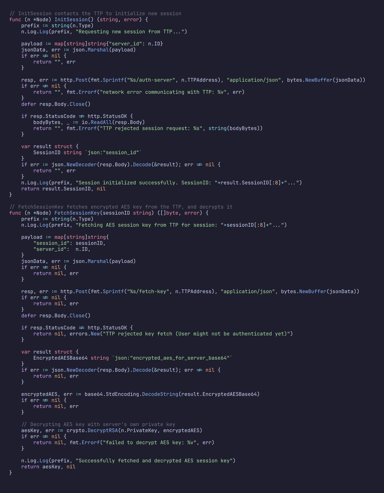

*Listing 9: Funkcje `InitSession()` (linie 161–191) oraz `FetchSessionKey()`
(linie 193–237) w pliku `node/node.go`.*

## 4.7. Detekcja ataku MITM

Kluczowym elementem bezpieczeństwa systemu jest mechanizm weryfikacji
tożsamości Servera przez Usera. Po otrzymaniu klucza sesyjnego z TTP,
User porównuje `server_id` zwrócony przez TTP z `server_id` otrzymanym
bezpośrednio od Servera w kroku inicjalizacji sesji. Niezgodność oznacza
próbę ataku MITM — sesja jest natychmiast przerywana.

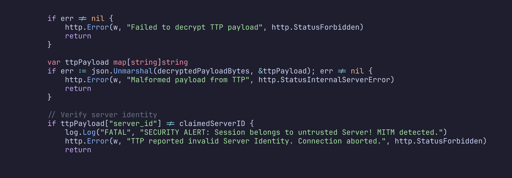

*Listing 10: Weryfikacja tożsamości Servera (linie 100–115) w pliku
`cmd/user/main.go`.*

W celu demonstracji odporności na ataki MITM zaimplementowano dedykowane
narzędzie — **MITM proxy** (`cmd/mitm/main.go`). Proxy nasłuchuje na porcie
`9393`, przekazuje ruch do prawdziwego Servera, ale podmienia pole
`server_id` w odpowiedzi inicjalizacyjnej na fałszywą wartość. Aplikacja
User po wykryciu rozbieżności wyświetla komunikat o zablokowaniu ataku.

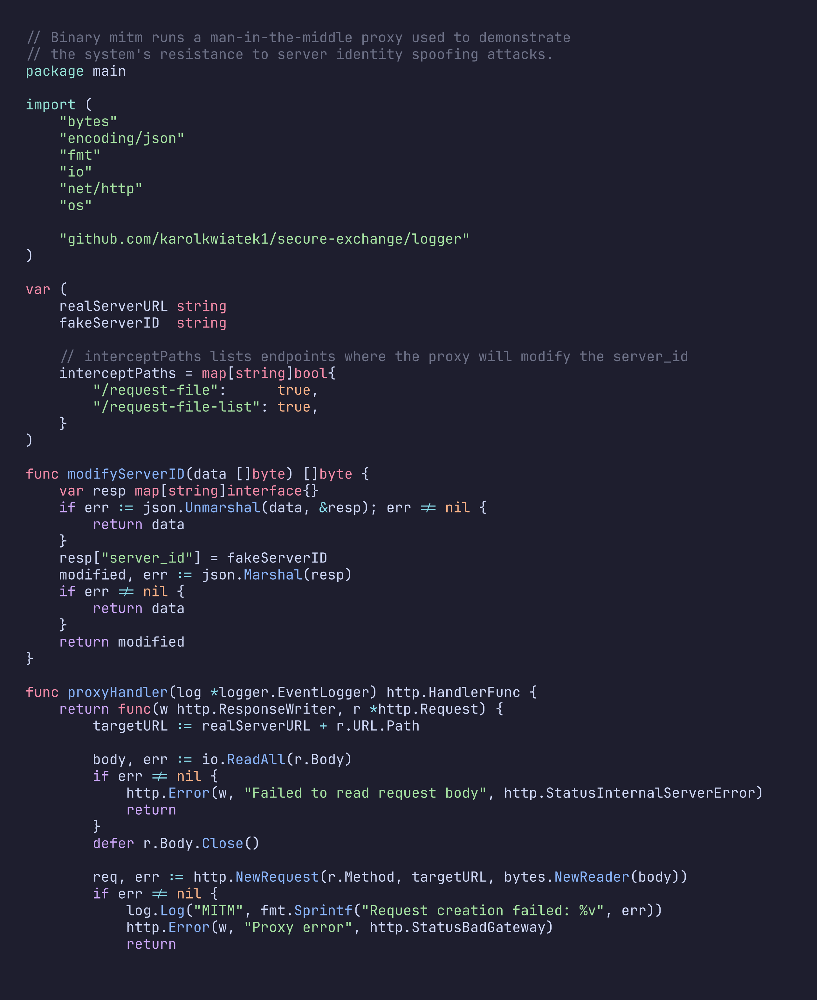

*Listing 11: Implementacja MITM proxy (linie 1–55) w pliku `cmd/mitm/main.go`.*

**Sposób przeprowadzenia testu MITM:**

1. Uruchom system: `./run.sh`
2. W drugim terminalu: `go run ./cmd/mitm`
3. W interfejsie webowym (http://localhost:9000) kliknij przycisk
   *"Symuluj atak MITM"*
4. System wykrywa niezgodność `server_id` i wyświetla komunikat
   o zablokowaniu ataku.

> **[MIEJSCE NA ZRZUT EKRANU — interfejs użytkownika po wykryciu ataku MITM]**
> *Wykonaj zrzut ekranu przeglądarki pokazujący zielony komunikat
> "ATAK ZABLOKOWANY" w konsoli logów aplikacji User.*

## 4.8. System logowania zdarzeń

Wszystkie komponenty systemu (TTP, Server) zapisują logi zdarzeń
z timestampami w formacie RFC 3339. Logger jest wątkowo-bezpieczny
(`sync.Mutex`) i zapisuje jednocześnie na standardowe wyjście oraz
do pliku w katalogu `logs/`.

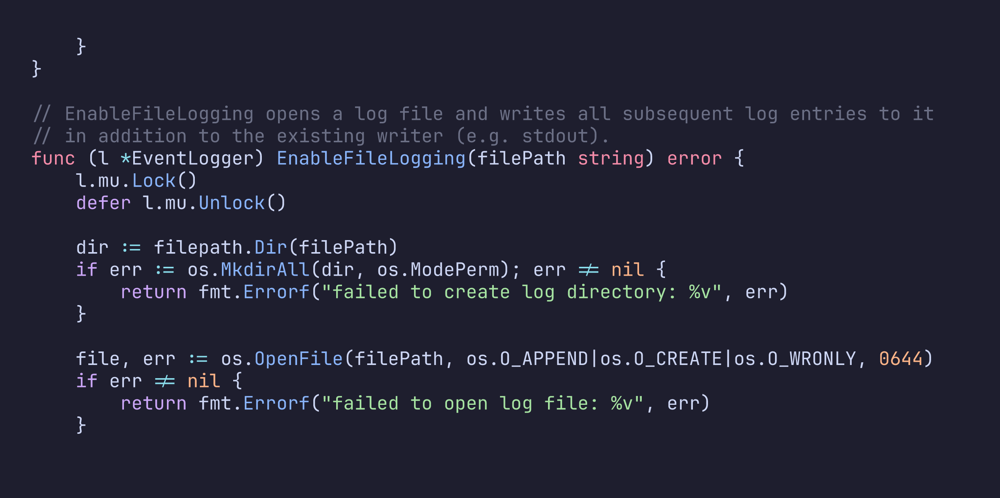

*Listing 12: Funkcja `EnableFileLogging()` (linie 27–47) w pliku
`logger/logger.go`.*

> **[MIEJSCE NA ZRZUT EKRANU — zawartość pliku `logs/ttp.log`]**
> *Wykonaj zrzut ekranu pokazujący fragment pliku logu TTP z wpisami
> o rejestracji encji, inicjalizacji sesji i dystrybucji klucza.*

> **[MIEJSCE NA ZRZUT EKRANU — zawartość pliku `logs/server.log`]**
> *Wykonaj zrzut ekranu pokazujący fragment pliku logu Servera z wpisami
> o żądaniach plików i operacjach szyfrowania.*

---

# 5. Testy i walidacja

## 5.1. Testy jednostkowe

Projekt zawiera zestaw testów jednostkowych weryfikujących poprawność
działania kluczowych komponentów:

| Pakiet | Plik testowy | Zakres testów |
|--------|-------------|---------------|
| `crypto` | `crypto_test.go` | Generacja kluczy RSA, szyfrowanie/deszyfrowanie AES-GCM i RSA-OAEP |
| `crypto` | `pem_test.go` | Kodowanie/dekodowanie PEM kluczy i certyfikatów |
| `crypto` | `x509_test.go` | Generacja Root CA, wystawianie i weryfikacja certyfikatów X.509 |
| `logger` | `logger_test.go` | Logowanie timestampów, zapis do pliku, wątko-bezpieczeństwo |
| `ttp` | `service_test.go` | Rejestracja encji, inicjalizacja sesji, dystrybucja kluczy |
| `cmd/ttp` | `main_test.go` | Testy integracyjne endpointów HTTP TTP |

Wynik uruchomienia testów:

```
$ go test ./...
ok   github.com/karolkwiatek1/secure-exchange/cmd/ttp     3.671s
ok   github.com/karolkwiatek1/secure-exchange/crypto       (cached)
ok   github.com/karolkwiatek1/secure-exchange/logger       0.005s
ok   github.com/karolkwiatek1/secure-exchange/ttp          0.664s
```

## 5.2. Testy bezpieczeństwa — atak MITM

Przeprowadzono testy odporności na atak *man-in-the-middle* z wykorzystaniem
dedykowanego proxy (`cmd/mitm`). Scenariusz testowy:

1. **Konfiguracja:** Uruchomiony TTP, Server (prawdziwy) oraz MITM proxy
   na porcie 9393.
2. **Atak:** User łączy się przez proxy (myśląc, że to prawdziwy Server).
   Proxy przekazuje żądanie do prawdziwego Servera, ale podmienia `server_id`
   na fałszywy.
3. **Weryfikacja:** User otrzymuje klucz sesyjny z TTP, który zawiera
   prawdziwy `server_id`. Porównanie wykrywa rozbieżność.
4. **Rezultat:** Połączenie zostaje przerwane, User otrzymuje komunikat
   o zablokowaniu ataku.

> **[MIEJSCE NA ZRZUT EKRANU — interfejs użytkownika po rejestracji, pokazujący
> listę plików]**
> *Wykonaj zrzut ekranu przeglądarki pokazujący główny interfejs aplikacji
> z listą dostępnych plików (test1.txt, test2.txt) po poprawnej rejestracji.*

---

# 6. Dokumentacja kodu

Dokumentacja kodu źródłowego została wygenerowana przy użyciu narzędzia
`pkgsite` (oficjalne narzędzie dokumentacyjne dla ekosystemu Go,
odpowiednik `godoc`). Wyeksportowana statyczna wersja dokumentacji znajduje
się w katalogu `documentation/` i zawiera:

- Dokumentację wszystkich pakietów (`crypto`, `logger`, `node`, `ttp`)
- Dokumentację wszystkich binarek (`cmd/ttp`, `cmd/server`, `cmd/user`, `cmd/mitm`)
- Hiperłącza między typami, funkcjami i pakietami
- Indeks funkcji i typów z możliwością wyszukiwania

Dokumentację można przeglądać otwierając plik
`documentation/github.com/karolkwiatek1/secure-exchange/index.html`
w przeglądarce.

> **Uwaga:** Zgodnie z wymaganiami projektu preferowanym narzędziem jest
> Doxygen, jednak dla projektu w języku Go standardowym i rekomendowanym
> narzędziem dokumentacyjnym jest `pkgsite`/`godoc`, które generuje
> dokumentację bezpośrednio z komentarzy w kodzie źródłowym w formacie
> rozumianym przez cały ekosystem Go.

---

# 7. Parametry kryptograficzne

Poniższa tabela podsumowuje stałe parametry kryptograficzne użyte w projekcie:

| Parametr | Wartość | Lokalizacja |
|----------|---------|-------------|
| Długość klucza RSA | 4096 bitów | `crypto/crypto.go:17` |
| Padding RSA | OAEP z SHA-256 | `crypto/crypto.go:88–89` |
| Długość klucza AES | 256 bitów (32 B) | `crypto/crypto.go:32` |
| Tryb AES | GCM (AEAD) | `crypto/crypto.go:46` |
| Długość nonce AES-GCM | 12 B | `crypto/crypto.go:51` |
| Funkcja skrótu dla ID | SHA-256 | `crypto/crypto.go:26` |
| Długość SessionID | 128 bitów (16 B) | `ttp/service.go:105` |
| Generator pseudolosowy | `crypto/rand` (CSPRNG) | `crypto/crypto.go:17,33` |
| Ważność certyfikatu CA | 1 rok | `crypto/x509.go:22` |
| Ważność cert. encji | 1 miesiąc | `crypto/x509.go:55` |

---

# 8. Struktura projektu

```
scs_tu1314_kwiatek/
├── cmd/
│   ├── ttp/main.go            # Aplikacja TTP (port 8181)
│   ├── server/main.go         # Aplikacja Server (port 8282)
│   ├── user/main.go           # Aplikacja User  (port 9000)
│   └── mitm/main.go           # MITM proxy     (port 9393)
├── crypto/
│   ├── crypto.go              # RSA, AES-256-GCM, SHA-256, CSPRNG
│   ├── pem.go                 # Kodowanie/dekodowanie PEM
│   └── x509.go                # Certyfikaty X.509 (CA + encje)
├── ttp/
│   └── service.go             # Logika biznesowa TTP
├── node/
│   └── node.go                # Abstrakcja uczestnika (User/Server)
├── logger/
│   └── logger.go              # System logowania
├── static/
│   └── index.html             # Interfejs webowy Usera
├── documentation/             # Dokumentacja pkgsite (HTML)
├── report/                    # Niniejszy raport
├── docker-compose.ttp.yml     # Konfiguracja Docker — TTP
├── docker-compose.server.yml  # Konfiguracja Docker — Server
├── Dockerfile                 # Wieloetapowy build Docker
├── run.sh                     # Skrypt orkiestrujący
└── go.mod                     # Definicja modułu Go
```

---

# 9. Wnioski

Zrealizowany system demonstruje kompletny scenariusz bezpiecznej wymiany
danych z wykorzystaniem Zaufanej Trzeciej Strony. Implementacja spełnia
wszystkie kluczowe wymagania projektu:

- Generacja certyfikatów X.509 przez Root CA
- Uwierzytelnianie dwustronne (User i Server) z udziałem TTP
- Dystrybucja klucza sesyjnego AES-256 szyfrowanego asymetrycznie (RSA-4096)
- Szyfrowana wymiana danych (AES-256-GCM)
- Detekcja i blokowanie ataków MITM
- Logowanie zdarzeń z timestampami
- Separacja komponentów w kontenerach Docker
- Interfejs webowy dla użytkownika

---

# 10. Bibliografia

1. Rajchowski P., *Emulating environment with Trusted Third Party
   and Client-Server data exchange scenario*, ENG SCS 2026 project v1.1,
   Politechnika Gdańska, 2026.

2. Go Standard Library: `crypto/rsa` — implementacja algorytmu RSA
   (PKCS#1 v2.2 OAEP), https://pkg.go.dev/crypto/rsa

3. Go Standard Library: `crypto/aes` — implementacja AES (FIPS 197),
   https://pkg.go.dev/crypto/aes

4. Go Standard Library: `crypto/x509` — implementacja X.509 (RFC 5280),
   https://pkg.go.dev/crypto/x509

5. Go Standard Library: `crypto/rand` — kryptograficznie bezpieczny
   generator pseudolosowy, https://pkg.go.dev/crypto/rand

6. National Institute of Standards and Technology (NIST),
   *Recommendation for Block Cipher Modes of Operation: Galois/Counter
   Mode (GCM) and GMAC*, NIST SP 800-38D, 2007.

7. RFC 5280 — *Internet X.509 Public Key Infrastructure Certificate
   and Certificate Revocation List (CRL) Profile*, 2008.

8. RFC 8017 — *PKCS #1: RSA Cryptography Specifications Version 2.2*, 2016.

---

# 11. Załączniki

## A. Repozytorium kodu

- **GitLab PG:** `git@git.pg.edu.pl:pggit_oidc4152412/scs_tu1314_kwiatek.git`
- **GitHub (mirror):** `git@github.com:karolkwiatek1/secure-exchange.git`

## B. Uruchomienie systemu

```bash
# Wymagania: Go 1.26+, Docker, Docker Compose
./run.sh
# Otwórz http://localhost:9000 w przeglądarce

# Test MITM (osobny terminal):
go run ./cmd/mitm
# Następnie kliknij "Symuluj atak MITM" w UI
```

## C. Generacja dokumentacji

```bash
~/go/bin/pkgsite -http=:6060 &
python3 export_pkgsite.py
# Dokumentacja statyczna w katalogu documentation/
```
